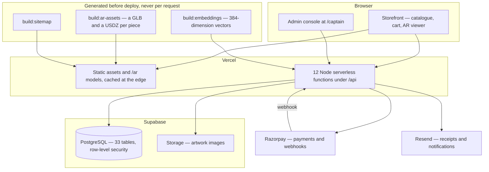
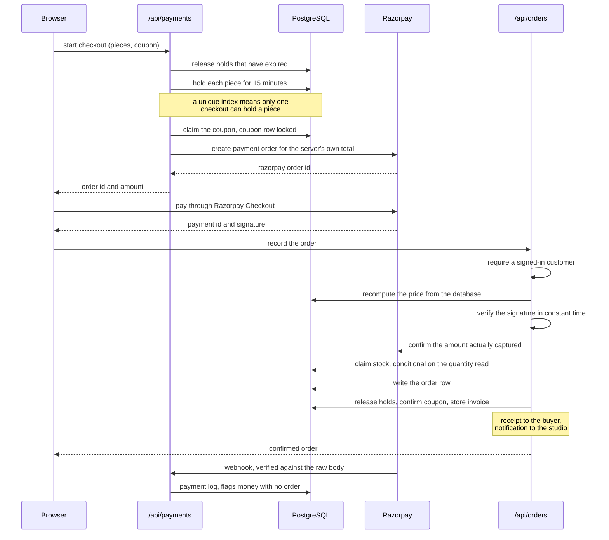
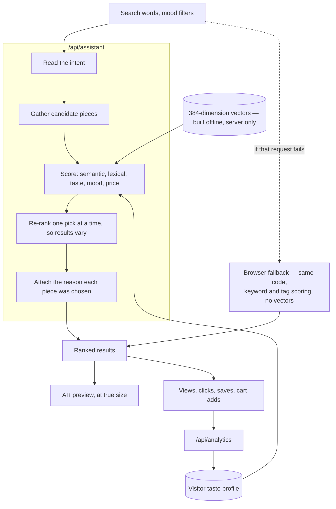

# Archique

E-commerce storefront for original, one-of-a-kind artwork, built for a working studio.

**Live:** [archique.in](https://www.archique.in)

Selling originals is not selling inventory. Every piece has a quantity of one, so two buyers reaching checkout together is a real failure, not a rounding error. Pieces are physical objects whose dimensions decide both what a buyer receives and what shipping costs, and a wall is not a product page. The system is built around those constraints.

**Stack:** React 19 · Vite · React Router 7 · Node serverless functions · PostgreSQL (Supabase) · Razorpay · Resend · Vercel

---

## Contents

[Architecture](#architecture) · [Features](#features) · [Implementation notes](#implementation-notes) · [Discovery and search](#discovery-and-search) · [Augmented reality](#augmented-reality) · [API](#api) · [Data model](#data-model) · [Getting started](#getting-started) · [Configuration](#configuration) · [Project layout](#project-layout) · [Testing](#testing) · [Deployment](#deployment) · [Design decisions](#design-decisions)

---

## Architecture



A React single-page application is served as static assets from the CDN. Every privileged operation runs inside a serverless function; the browser never receives a service-role key, and no client-supplied price, discount, or stock figure is trusted.

---

## Features

**Storefront.** Search, sort, and filter by category, availability, medium, and size. Each artwork page carries dimensions, medium, provenance, shipping cost, an AR preview, and pairing suggestions. Cart and wishlist work without an account and survive reloads and tabs.

**Checkout.** Three steps on three screens — delivery details, itemised review, payment. Several pieces can be bought in one order.

**Multi-piece pricing.** Two related pieces discount 10%, three or more 15%. Where a curated combo also applies the buyer receives whichever is larger; the two never stack. Shipping is charged as one parcel — the highest single rate plus 25% of each additional piece.

**Accounts.** Email and password, or Google. Sign-up captures phone and delivery address, so checkout is not the first time anyone is asked. Order tracking answers the owner only.

**Commissions.** Free-text requests are parsed into a structured brief — mood, palette, size, deadline.

**Administration.** A console at `/captain`, authenticated separately from customer accounts, covering catalogue and stock, order lifecycle, coupons, combos, commissions, enquiries, and testimonials. Revenue and per-artwork engagement are reported; orders export to CSV; every privileged action is logged with the acting administrator and a timestamp.

---

## Implementation notes

### Server-authoritative pricing

The client submits artwork identifiers, never prices. The server loads current prices, recomputes discounts, revalidates coupons against their own redemption counts, recalculates shipping from stored dimensions, and derives the total. A tampered request changes what is *ordered*, never what is *charged*.

### Stock and concurrency

Serverless functions share no memory and PostgREST exposes no interactive transactions, so exclusion comes from the database. Stock is claimed by conditional update — a compare-and-swap that succeeds only if the row still holds the quantity the request observed. Two simultaneous buyers produce exactly one success and one clean rejection.

Stock is claimed **before** the order row is written. The other way round, a failed claim would leave a paid order pointing at a piece someone else had bought.

### Payment integrity



Confirmation is never taken on the client's word. The server recomputes the HMAC-SHA256 signature and compares it in constant time, then confirms the amount Razorpay actually captured. Webhooks are verified against the **raw** body — re-serialising parsed JSON changes the bytes and invalidates the signature — so body parsing is disabled on that route. Payment identifiers are unique, so a replayed webhook cannot produce a second order.

### Coupons

Limits are enforced by the database, not by a read followed by a write. A claim locks the coupon row, counts what is held, and writes the redemption in one transaction, and it happens before payment — the last point at which refusing a customer is still free. Claims carry the checkout's reservation token and expire with it, so an abandoned checkout returns the coupon.

### Input validation and uploads

Every request body is parsed by a Zod schema at the boundary: plausible address lengths, phone numbers against the Indian mobile numbering plan, an upper bound on every free-text field. Uploads are capped at 10 MB and restricted to images, with the client-declared MIME type ignored in favour of the file's actual signature bytes.

### Rate limiting and caching

Counters live in PostgreSQL rather than memory, since serverless instances share none. Authentication endpoints are limited per IP and per hashed account identifier. Catalogue reads are cached at the edge with `stale-while-revalidate`; administrator reads bypass the cache explicitly.

### Client state

The cart is an external store read through `useSyncExternalStore` — every subscriber re-renders together, no provider wraps the tree, and non-React code can read it. It persists to `localStorage` and follows storage events across tabs. Routes are code-split with `React.lazy`; the AR viewer, the heaviest dependency, loads only when a buyer opts in.

### Interface

The homepage places navigation over full-bleed artwork, so the page samples the brightness of the pixels actually on screen — accounting for `object-fit` cropping — and switches overlay text between light and dark, evaluating header and body regions separately.

The gold accent works as a border but fails as text: `#c6a962` reaches about 2.3:1 on a light background, against the 4.5:1 body text needs. Decoration and text therefore draw from separate tokens, with a darkened variant at roughly 5:1 for anything read.

### Transactional email

Sent from a domain alias with SPF, DKIM, and DMARC configured; the studio's personal address appears nowhere in the interface or the bundle. The provider reports delivery failures in the response body rather than throwing, so the send path inspects the result explicitly.

---

## Discovery and search



No model is loaded at request time and no inference service is called, so responses are fast, free, and identical for identical inputs.

**Semantic.** `npm run build:embeddings` encodes each artwork with `Xenova/all-MiniLM-L6-v2` offline and writes the vectors into the repository; queries are matched by cosine similarity. The generated file is server-only.

**Lexical.** Tags, category, medium, and title are scored alongside the semantic signal, keeping exact-term queries reliable where embeddings are vague.

**Behavioural.** Views, clicks, and dwell build a session-level taste profile that reorders results, with no sign-in required.

**Diversity.** Re-ranking is greedy rather than single-pass: the penalty is recomputed against what has already been selected, which a one-shot score cannot do.

An optional offline script, `ml/build_image_intelligence.py`, derives visual similarity from artwork images with PyTorch and writes a JSON artifact. Python is never invoked at runtime.

---

## Augmented reality

A buyer can place a piece on their own wall at true physical size, without installing anything. Rendering is delegated to each platform's own viewer through Google's `<model-viewer>`.

| Platform | Path |
| --- | --- |
| iOS Safari | AR Quick Look (`.usdz`) |
| Android | Scene Viewer / WebXR (`.glb`) |
| Desktop | Interactive 3D preview, with a QR code to continue on a phone |

Models are scaled from recorded dimensions and anchored to a vertical surface. Materials are emissive by design: an exported scene carries no lights, and a lighting-dependent material renders as a black rectangle on any device that supplies none.

Assets are generated offline by `scripts/build-ar-assets.mjs`, written to `public/ar/`, and indexed in a manifest. A scheduled workflow regenerates them, because artwork data lives in the database rather than in git. The camera feed never leaves the device.

---

## API

`vercel.json` rewrites clean paths onto query parameters, so `/api/orders/:id/status` reaches the same function as `/api/orders?id=…&action=status`.

| Route | Responsibility |
| --- | --- |
| `/api/artworks` | Catalogue reads, administrator writes |
| `/api/orders` | Order creation, lookup, status transitions |
| `/api/payments` | Razorpay orders, signature verification, webhooks |
| `/api/user` | Registration, sign-in, delivery profiles |
| `/api/admin` | Administrator auth, dashboard, order export |
| `/api/coupons` | Validation and redemption |
| `/api/commissions` | Commission requests |
| `/api/inquiries` | Contact form |
| `/api/testimonials` | Customer reviews |
| `/api/assistant` | Search and recommendations |
| `/api/analytics` | Behavioural event ingestion |
| `/api/upload` | Image upload to Supabase Storage |

---

## Data model

PostgreSQL, migrated through ordered SQL files. Thirty-three tables; the principal ones:

| Table | Contents |
| --- | --- |
| `artworks` | Dimensions, medium, pricing, stock, images |
| `orders` | Purchases, delivery details, payment status, lifecycle timestamps |
| `payment_logs` | Razorpay event trail for reconciliation |
| `artwork_reservations` | Checkout holds, one live hold per piece |
| `user_accounts` | Customers and saved delivery profiles |
| `admins`, `admin_sessions`, `admin_activity_logs` | Administrator identity and audit trail |
| `coupons`, `coupon_redemptions` | Discount codes and their use |
| `combos` | Curated multi-piece offers |
| `visitor_sessions`, `visitor_events`, `analytics_events` | Behavioural signals |
| `rate_limits` | Distributed rate-limit counters |

Orders move through `pending → advance_paid → processing → shipped → delivered`, with `cancelled` reachable before dispatch. Transitions are applied server-side and timestamped. Behavioural tables are pruned on a schedule. Timestamps are `timestamptz` throughout.

---

## Getting started

**Requirements:** Node.js 20+, a Supabase project, a Razorpay account.

```bash
git clone https://github.com/CaptainAni187/Archique.git
cd Archique
npm install
```

Create `.env` from [Configuration](#configuration), then apply `supabase/migrations/` in filename order.

```bash
npm run dev       # Vite dev server, port 5173
npm run dev:api   # serverless function host, port 3001
```

Vite proxies `/api` to the function host, so the application behaves as it does in production.

---

## Configuration

Read from the environment; `.env` is git-ignored.

**Client** — compiled into the bundle, publishable values only.

| Variable | Purpose |
| --- | --- |
| `VITE_SUPABASE_URL` | Supabase project URL |
| `VITE_SUPABASE_ANON_KEY` | Anonymous key, for Google OAuth |
| `VITE_RAZORPAY_KEY_ID` | Razorpay publishable key |

**Server** — never exposed to the browser.

| Variable | Purpose |
| --- | --- |
| `SUPABASE_URL` | Falls back to `VITE_SUPABASE_URL` |
| `SUPABASE_SERVICE_ROLE_KEY` | Full database access; the most sensitive value here |
| `RAZORPAY_KEY_ID` | Falls back to `VITE_RAZORPAY_KEY_ID` |
| `RAZORPAY_KEY_SECRET` | Signs and verifies payment signatures |
| `RAZORPAY_WEBHOOK_SECRET` | Verifies webhook authenticity |
| `ADMIN_EMAIL`, `ADMIN_PASSWORD` | Seed administrator credentials |
| `ADMIN_SESSION_SECRET` | Signs administrator tokens |
| `USER_SESSION_SECRET` | Signs customer tokens; must differ from the admin secret |
| `RESEND_API_KEY`, `FROM_EMAIL` | Transactional email |
| `INQUIRY_NOTIFICATION_RECIPIENTS` | Contact form notification recipients |

Administrator and customer tokens are signed with independent secrets, so compromising one cannot forge the other.

---

## Project layout

```
api/              serverless functions, one file per route group
  _lib/           sessions, validation, rate limiting, Razorpay, Supabase, email
shared/ai/        ranking, search, and tagging, used by client and server
src/
  pages/          route components
  components/     shared UI, including the administrator console
  services/       API clients
  state/          cart and order state
  utils/          pricing, image measurement, formatting
scripts/          offline generators: embeddings, AR assets, audits
supabase/
  migrations/     schema, applied in filename order
tests/            Vitest suites
```

---

## Testing

```bash
npm test     # Vitest
npm run lint # ESLint
npm run build
```

Coverage is concentrated where failure costs money or trust: payment signature verification and replay rejection, order creation, stock restoration and its concurrency cases, coupon claiming, administrator authentication, request validation, and analytics ingestion. Suites exercise the real handlers through mocked HTTP objects, so a route that stops matching its own validation schema fails the build.

---

## Deployment

Vercel builds the static site and deploys `api/` as serverless functions. Environment variables are read at build time, so changing one requires a redeploy.

**Function count.** The Hobby plan permits twelve serverless functions and the project sits at twelve. Exceeding it does not fail the build — the build succeeds and the deployment silently does not update, presenting as production running stale code. New endpoints belong as an `action` on an existing handler.

**Cache bypass.** Administrator reads must not be served from the CDN.

```bash
npm run build:embeddings   # after catalogue changes
npm run build:ar-assets    # regenerate AR models
```

---

## Design decisions

**Precomputed embeddings over a hosted inference API.** A large hosted model would improve search at the cost of per-query spend, latency, and a dependency on someone else's uptime. At this catalogue size, offline encoding plus cosine similarity captures most of the benefit with none of those liabilities.

**PostgreSQL over a vector database.** A few hundred vectors fit in memory. A vector store would add an operational component to earn its keep at a scale this catalogue will not reach soon.

**Conditional updates over transactions.** PostgREST exposes no interactive transactions. Rather than add a connection-pooled service to obtain them, stock claims use a compare-and-swap, which is sufficient for single-row exclusivity and keeps the deployment on one platform.

**A modular monolith over microservices.** Route groups own their domains and share a `_lib` layer. Splitting them would multiply deployment surface and cold starts without dividing any load that needs dividing.

**Full payment upfront over a partial advance.** A piece leaves the catalogue the moment it is reserved. Holding a one-of-one item against a partial payment transfers the risk of an abandoned order onto the studio.

---

## License

All rights reserved. The artwork shown is the property of the artist and is not licensed for reuse.
